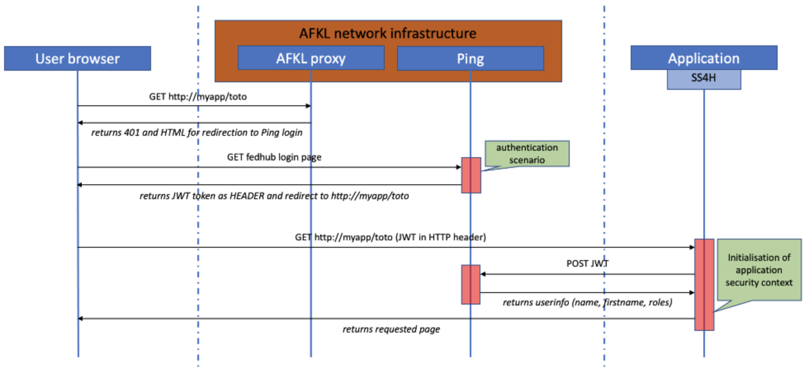

# Spring Security 4 Habile

This Git repo contains the code to secure your springBoot application with Habile.

If you face any issue using this component, please request support by opening a ticket in [JSD](https://jira.devnet.klm.com/servicedesk/customer/portal/7)

Release notes for each version (starting version 3.0.0) is [>>> here <<<](https://confluence.devnet.klm.com/x/XbpoDQ)

**Keep in mind that all URLs listed in this document are relative. So if you have a context-path defined, you have to add it to get the full URL.**

**For non SpringBoot application: SS4H (starting from version 4.0.0) is now based on SpringBoot 3 which requires at least Tomcat 10**

## Breaking change

**5.0.0** In addition to the reactive stack implementation, this SS4H version updates the property names defining the required Spring authorities required for accessing the configured endpoints.
This renaming has been made for consistency purpose after allowing not only roles but also so called permissions to be defined as required authorities. The rest of the document describes how to use the new property names but as a sum up, here are the changes: **urls-http-verbs-roles-configurations** into **urls-http-verbs-authorities**, **http-verbs-roles** into **http-verbs-authorities**.

**4.0.0** This version of SS4H is a major update, not in terms of new functionalities but in terms of breaking changes. SS4H now relies on **Java 17**, **Spring Boot 3** and **Spring Security 6**. Thus, many dependencies have changed and should be reflected in your own project using SS4H module(s). The main difference concerns most of Java classes previously found in **javax.* ** packages which have now be moved in their **jakarta.* ** counterparts. Proper attention should be taken while updating/cleaning dependencies in your Maven POM files.
For further details of the breaking changes carried on by this new release, you can consult the release notes of the aforementioned Java and Spring dependencies.

**3.1.0** The library now defines the **@EnableGlobalMethodSecurity** annotation. If you also have it in your code you need to remove it, otherwise you will have the error **Caused by: org.springframework.beans.factory.support.BeanDefinitionOverrideException: Invalid bean definition with name 'metaDataSourceAdvisor' defined in null**

**3.0.6** The configuration of public endpoint is not done any more by class inheritance but done with the yml file (please refer to dedicated section).

**3.0.4** Starting from this release there is a breaking change for users of **urls-roles-configurations**.
If you don't have this configuration in your yml file, then it's just a new feature.
The new feature allows to define a global access policy based on the HTTP verb in addition of the fine-grained definition offered by the @PreAuthorize.
Pay attention that the access policy defined within the yml file will be applied before the more fine-grained @PreAuthorize. 
Its purpose is to allow you to define global policies, like all DELETE methods need admin privileges.
**All HTTP methods not listed will not be accessible. Deny all policy will be applied for everything not explicitly mentioned.**
For further details please check the section **Configure global access policy based on the HTTP verbs (optional)**

**3.x.x** This is a major update. This version of the component is able to handle both SiteMinder (in fact Ping in SiteMinder compliancy mode) and Ping PreAuthentication systems. 

**Versions 2.X should not be used anymore after xx January 2021**

### Upgrading from version 2

Modify your pom to target version 3 or above.

There should be no impact on the application code but the tests may have to be modified if you are making tests slicing.

The class **RolePermissionConfig** has been removed and replaced by the **Ss4hProperties**. So, if you have any manual **@Import** to this class just rename it.

## User guide

This user guide must be used by any SpringBoot project on the AF/KLM network that need to authenticate end users.

**BEFORE GOING ANY FURTHER YOU NEED TO IDENTIFY WHAT AUTHENTICATION FLOW IS ACTIVATED FOR YOUR APPLICATION** and then read the sections of this page dedicated to your situation.

### Installation guide

This section is common to Ping and SiteMinder modes.

Before anything, please keep in mind that this module is a SpringBoot auto starter library. You don't need to include anything else than it in your pom declaration on your application to make it work.

	@SpringBootApplication
	public class MySpringBootApplicationStandalone {

Let's also add the dependency for our custom module: **spring-security-habile** (to know the latest version, check in [Maven repository](https://nexus.devnet.klm.com/#browse/search/maven=attributes.maven2.artifactId%3Dspring-security-habile))... 

	<dependency>
		<groupId>com.afklm.springboot.habile</groupId>
		<artifactId>spring-security-habile</artifactId>
		<version>X.Y.Z</version>
	</dependency>

Starting from the release 5.0.0, SS4H is also available in reactive mode. If you want to take advantage of this new operating mode while building a new application or refactoring an existing one, you have to use the following dependency instead:

    <dependency>
        <groupId>com.afklm.springboot.habile</groupId>
        <artifactId>spring-security-habile-reactive</artifactId>
        <version>X.Y.Z</version>
    </dependency>

In Ping mode you can jump to the next section: **Configuration**

In SiteMinder compatibility mode, you also need to include **SDFW** (AFKL SOA Framework) and the **w000479** stub in your application, and configure your application to consume it.

**Note:** SS4H in reactive mode only supports Ping authentication, thus SiteMinder compatibility mode with **w000479** web service based authentication is NOT supported !

You can find some documentation on SOA in [SOA confluence page](https://confluence.devnet.klm.com/display/TECIS/SpringBoot).

If you need any assistance regarding this SOA topic, please contact TASC for support.

If you need any assistance on doing this, please contact TASC for support: [SOA JSD](https://jira.devnet.klm.com/servicedesk/customer/portal/80).
This part of the configuration (ie. regarding SOA configuration) 

**The lifecycles of the SDFW component and this component are different**. Please check into [Nexus](https://nexus.devnet.klm.com/#browse/search/maven=attributes.maven2.artifactId%3Dsdfw-dependencies) 
what is the last available version of the SDFW. If needed please update your pom accordingly.

## Configuration

### CSRF

**Warning: CSRF protection is enabled by default by Spring Security.**

To access non-GET resources, the client application needs to send a token set by Spring Security as a Cookie.  
By default, Angular performs this operation silently, it extracts the **XSRF-TOKEN** cookie and sets the correct HTTP header **X-XSRF-TOKEN**.

Here is a brief introduction about CSRF from OWASP : https://www.owasp.org/index.php/Cross-Site_Request_Forgery

### Endpoints

Below are endpoints exposed automatically by the SS4H module. You do not need to define them anywhere.

#### Permissions

Make a **GET** call to `/me` to retrieve your :
* username,
* lastname,
* firstname,
* roles,
* permissions

#### Logout

The `/logout` endpoint allows you to kill the session in your backend application and also in the Habile/Ping authentication system.

When you want to log out the user, you need to process a **POST** request to your backend `/logout` endpoint. In response you will have either the **X-LOGOUT-URL** (Ping mode) or **SM_LOGOUT** (SiteMinder compatibility mode) HTTP header that you must follow through a redirect in order to disconnect the user from Habile authentication system.

### Endpoint protection

In SS4H world, we use either **roles** and/or **permissions** to protect a resource, both concepts being known as
so-called **authorities** in Spring Security. 
A role is simply a coarse-grained form of authority to which permissions can be optionally assigned.
In Spring Security internals, a role is referenced as a pure Spring authority from its name to which the prefix
**`ROLE_`** is prepended. For instance, considering a role called **`STUDENT`**, internally it will be mapped to an 
authority called **`ROLE_STUDENT`**. 
On the other hand, a permission represents a fine-grained form of authority that is not semantically considered as a
role. It is directly mapped to a pure Spring authority.
**`READ_BOOKING`** or **`WRITE_REPORT`** are examples of application-specific permissions. As we will see below,
you can then assign a set of permissions to a given role in the configuration. 

In UA2, we have **families** and **profiles** for granting access to a resource. However, as Habile has been configured,
**families** are never propagated to the backend application, only profiles are provided. Thus, an UA2 **profile** is
implicitly mapped to a Spring Security **role**, considering the backend application is properly configured. The roles
naming in SS4H, starting with the **`P_`** prefix, is explained by this UA2 mapping whose naming convention is to start
any profile name with that prefix.

#### Define roles and permissions in your application

This section explains how to configure roles and permissions in your application.

Please keep in mind that the authorities available in the Spring Security context is the result of the intersection
between the list of profiles a user owns in UA2 and the list of roles/permissions the application defines in its
configuration (i.e. present in the yaml/properties file). 

This also means that if a user does not own any profile, although successfully authenticated, it will not be able
to access any resource that is explicitly protected by either role or permission. 

Here is an example of configuration in YAML format:

    # Add the complete list of roles, with or without fine-grained permissions, supported by your application.
    # This list depends on the profile defined in your UA2 project settings.
    # Roles: P_XXXXX_ROLE_ONLY, P_XXXXX_ADMIN, P_XXXXX_USER
    # Permissions : CONSULT, MODIF, ASK, ASK_MORE, ASK_LESS
    afklm:
      security:
        roles:
          P_XXXXX_ROLE_ONLY:
          P_XXXXX_ADMIN:
            - CONSULT
            - MODIF
            - ASK
            - ASK_MORE
          P_XXXXX_USER:
            - CONSULT
            - ASK_LESS
            - ASK

And that same configuration in properties format:

    afklm.security.roles.P_XXXXX_ROLE_ONLY=

    afklm.security.roles.P_XXXXX_ADMIN[0]=CONSULT
    afklm.security.roles.P_XXXXX_ADMIN[1]=MODIF
    afklm.security.roles.P_XXXXX_ADMIN[2]=ASK
    afklm.security.roles.P_XXXXX_ADMIN[3]=ASK_MORE

    afklm.security.roles.P_XXXXX_USER[0]=CONSULT
    afklm.security.roles.P_XXXXX_USER[1]=ASK_LESS
    afklm.security.roles.P_XXXXX_USER[2]=ASK

#### Configure access policy globally (optional)

First of all, resources can be protected globally, this is the first stage rampart applied.
This can be achieved through the configuration file as explained hereunder.

If you want to define a global access policy, you need to specify one or more blocks consisting of the 3 following
pieces of information:
*   the URL patterns for which it should be applied
*   the HTTP methods for which you want to grant access
*   the roles and/or permissions defined earlier that will be required to access the associated resources

> An HTTP method cannot appear more than once for every configuration block of URLs.

> Any context path defined for your application (i.e. `server.servlet.context-path`) should not be part of any
URL pattern defined here.

> A URL pattern must start with `/`, ends with `/**` and have something defined in between.

> Implicitly, all resources covered by a set of URL patterns but whose HTTP methods are not listed will get a
'Deny-All' policy applied.

> On the other hand, resources that are not covered by any URL pattern (excluding public resources and further
locally-protected ones) will be available as soon as the user is authenticated. Thus, it is very important to check that
a sensitive resource is properly covered by a URL pattern since an incorrect configuration might let think that it is
protected, although it will not be totally since simply accessible to any authenticated user in this case.

Here is an example of what you could define in YAML:

    afklm:
      security:
        urls-http-verbs-authorities:
          - urls: /api/user-only/hello/**, /api/test/**
            http-verbs-authorities:
             - verbs: GET
               roles: P_XXXXX_USER, P_XXXXX_ADMIN
             - verbs: POST, PUT
               roles: P_XXXXX_ADMIN
          - urls: /api/user-only/byebye/**
            http-verbs-authorities:
              - verbs: GET
                roles: P_XXXXX_ADMIN
          - urls: /api/user-only/howareyou/**
            http-verbs-authorities:
              - verbs: HEAD
                roles: P_XXXXX_ADMIN
                permissions: ASK_LESS
              - verbs: OPTIONS
                permissions: ASK_LESS, ASK_MORE
              - verbs: GET
                permissions: ASK
              - verbs: POST
                permissions: ASK_MORE

And that same configuration in properties format:

    afklm.security.urls-http-verbs-authorities[0].urls=/api/user-only/hello/**, /api/test/**
    afklm.security.urls-http-verbs-authorities[0].http-verbs-authorities[0].verbs=GET
    afklm.security.urls-http-verbs-authorities[0].http-verbs-authorities[0].roles=P_XXXXX_USER, P_XXXXX_ADMIN
    afklm.security.urls-http-verbs-authorities[0].http-verbs-authorities[1].verbs=POST, PUT
    afklm.security.urls-http-verbs-authorities[0].http-verbs-authorities[1].roles=P_XXXXX_ADMIN
    
    afklm.security.urls-http-verbs-authorities[1].urls=/api/user-only/byebye/**
    afklm.security.urls-http-verbs-authorities[1].http-verbs-authorities[0].verbs=GET
    afklm.security.urls-http-verbs-authorities[1].http-verbs-authorities[0].roles=P_XXXXX_ADMIN
    
    afklm.security.urls-http-verbs-authorities[2].urls=/api/user-only/howareyou/**
    afklm.security.urls-http-verbs-authorities[2].http-verbs-authorities[0].verbs=HEAD
    afklm.security.urls-http-verbs-authorities[2].http-verbs-authorities[0].roles=P_XXXXX_ADMIN
    afklm.security.urls-http-verbs-authorities[2].http-verbs-authorities[0].permissions=ASK_LESS
    afklm.security.urls-http-verbs-authorities[2].http-verbs-authorities[1].verbs=OPTIONS
    afklm.security.urls-http-verbs-authorities[2].http-verbs-authorities[1].permissions=ASK_LESS, ASK_MORE
    afklm.security.urls-http-verbs-authorities[2].http-verbs-authorities[2].verbs=GET
    afklm.security.urls-http-verbs-authorities[2].http-verbs-authorities[2].permissions=ASK
    afklm.security.urls-http-verbs-authorities[2].http-verbs-authorities[3].verbs=POST
    afklm.security.urls-http-verbs-authorities[2].http-verbs-authorities[3].permissions=ASK_MORE

In the given example :
*   /api/user-only/hello/\*\* and /api/test/\*\*
    *   GET method will be accessible to all callers having the role of P_XXXXX_USER or of P_XXXXX_ADMIN
    *   POST and PUT methods will be accessible only to callers having the role of P_XXXXX_ADMIN
    *   all other HTTP verbs (like DELETE, OPTIONS, PATCH...) will have a 'Deny-All' policy applied. So they won't be accessible to any caller.
*   /api/user-only/byebye/\*\*
    *   only GET method will be accessible and only for callers having the role of P_XXXXX_ADMIN
    *   all other HTTP methods will get the 'Deny-All' policy.
*   /api/user-only/howareyou/\*\*
    *   HEAD method will be accessible to all callers having the role of P_XXXXX_ADMIN or the permission of ASK_LESS (such as callers with the role of P_XXXXX_USER)
    *   OPTIONS method will be accessible to all callers having either the permission of ASK_LESS or ASK_MORE.
    *   GET method will be only accessible to all callers having the permission of ASK.
    *   POST method will be only accessible to all callers having the permission of ASK_MORE.

### Configure access policy locally (optional)

After the first rampart applied by the global policy, you can also protect your **endpoints** directly within the
controllers using Spring Security **`@PreAuthorize`** and/or **`@PostAuthorize`** annotations within which you write
a SpEL expression, such as **`hasRole()`** or **`hasAuthority()`**,  using a role or permission name respectively.

Here are such examples to be set within your controllers:

* @PreAuthorize("hasRole('P\_XXXXX\_ADMIN')")
* @PreAuthorize("hasAuthority('ASK_MORE')")
* @PreAuthorize("hasAuthority('ROLE\_P\_XXXXX\_USER')")

#### Configure anonymous access (optional)

If your application security settings allow anonymous access, here is what happens.

If you access an anonymous endpoint being already connected, the current connected user is kept.

If you access an anonymous endpoint without any previous authentication then a fake user will be populated.
The id, firstname, lastname and email will have hardcoded values and the profiles attached to that user can be
configured in YAML as below:

    afklm:
      security:
        anonymous-roles:
          - P_TEST_ROLE
          - P_TEST_OTHER_ROLE

The equivalent configuration in properties format will be:

    afklm.security.anonymous-roles[0]=P_TEST_ROLE
    afklm.security.anonymous-roles[1]=P_TEST_OTHER_ROLE

#### Configure Actuators access (optional)

You can restrict access to the **Actuators' endpoints** to certain role (only one) instead of all authenticated users.

You can use for example in YAML:

    afklm:
      security:
        actuators-role: P_ADMIN

Or in properties format:

    afklm.security.actuators-role=P_ADMIN

If you prefer to disable all **Actuators**, you can use in YAML:

    management:
      endpoints:
        enabled-by-default: false

Or in properties format:

    management.endpoints.enabled-by-default=false

#### Configure Content-Security-Policy header (optional)

The Content-Security-Policy header is an added layer of security that helps to protect your application against certain
type of attacks such as Cross-Site Scripting (XSS). It allows you to restrict how resources such as JavaScript, CSS,
etc... are loaded into the browser.
If you want your application to set the Content-Security-Policy header, you can use the following example:

    afklm:
      security:
        content-security-policy: upgrade-insecure-requests; frame-ancestors 'self'; font-src 'self' https://fonts.googleapis.com; script-src 'self'; object-src 'self';

Similarly in properties format:

    afklm.security.content-security-policy=upgrade-insecure-requests; frame-ancestors 'self'; font-src 'self' https://fonts.googleapis.com; script-src 'self'; object-src 'self';

>Disclaimer: The value of the Content-Security-Policy header can break your application and must be tested before
deployment. Please refer to the following article to get more details: https://confluence.devnet.klm.com/display/ITOPBDSD/Content-Security-Policy+HTTP+Header

### Configure public access (optional)

The definition of public path is now made in the configuration file.

For example to unprotect URLs that begin with `/foo/` and `/foo2`, in YAML:

    afklm:
      security:
        public-endpoints: /foo/**, /foo2/**

Similarly in properties format:

    afklm.security.public-endpoints=/foo/**, /foo2/**

If you have a long list of URLs and don't want to do it in a single line, you can use the following syntax in YAML:

    afklm:
      security:
        public-endpoints: >
          /foo/**,
          /foo2/**

Similarly in properties format:

    afklm.security.public-endpoints[0]=/foo/**
    afklm.security.public-endpoints[1]=/foo2/**

### Custom security principal

If you need to customize the **Principal** by adding custom fields you can create a bean that implements the **CustomUserDetailsService** interface and especially the **enrichUserDetails** method.

First extend the **HabileUserDetails** to add your custom fields

For example:

    package com.afklm.spring.security.habile.demo;
    
    import org.springframework.stereotype.Component;
    
    import com.afklm.spring.security.habile.HabileUserDetails;
    import com.afklm.spring.security.habile.demo.model.MyOwnUserDetails;
    import com.afklm.spring.security.habile.userdetails.CustomUserDetailsService;
    
    @Component
    public class CustomUserDetails implements CustomUserDetailsService {
        @Override
        public UserDetails enrichUserDetails(HabileUserDetails userDetails) {
            MyOwnUserDetails customUserDetails = new MyOwnUserDetails(userDetails);
            customUserDetails.setMyCustomField("TECC-custom-field");
            return customUserDetails;
        }
    }

and

    package com.afklm.spring.security.habile.demo.model;
    
    import com.afklm.spring.security.habile.HabileUserDetails;
    
    public class MyOwnUserDetails extends HabileUserDetails {
        private static final long serialVersionUID = 5769012717928806677L;
        
        private String myCustomField;
        
        public MyOwnUserDetails(HabileUserDetails habileUserDetails) {
            super(habileUserDetails.getUsername(),
                    habileUserDetails.getLastname(),
                    habileUserDetails.getFirstname(),
                    habileUserDetails.getEmail(),
                    habileUserDetails.getAuthorities(),
                    habileUserDetails.getIdToken());
        }
        
        public String getMyCustomField() {
            return myCustomField;
        }
        
        public void setMyCustomField(String myCustomField) {
            this.myCustomField = myCustomField;
        }
    }

If you need to expose this new **Principal** format to your frontend, you also need to override the **render()** method of the **CustomUserDetailsService** interface. You can simply return your new Principal format object 
but this will also return some unwanted fields. We highly recommend you to also create a new resource object that extends **com.afklm.spring.security.habile.web.UserResource** and to return this one. 
Below an example:

    @Override
    public Object render(UserDetails userDetails) {
        MyOwnUserDetails customInternaleUserDetails = (MyOwnUserDetails)userDetails;
        OwnUserResource newUserDetailsOutput = new OwnUserResource();
        newUserDetailsOutput.setUsername(customInternaleUserDetails.getUsername());
        newUserDetailsOutput.setIdToken(customInternaleUserDetails.getIdToken());
        newUserDetailsOutput.setFirstname(customInternaleUserDetails.getFirstname());
        newUserDetailsOutput.setLastname(customInternaleUserDetails.getLastname());
        newUserDetailsOutput.setEmail(customInternaleUserDetails.getEmail());
        customInternaleUserDetails.getAuthorities()
                    .stream()
                    .map(GrantedAuthority::getAuthority)
                    .forEach(auth -> {
                        if (auth.startsWith(ROLE_PREFIX)) {
                            newUserDetailsOutput.getRoles().add(auth.substring(ROLE_PREFIX.length()));
                        } else {
                            newUserDetailsOutput.getPermissions().add(auth);
                        }
                    });
        newUserDetailsOutput.setCustomOutputField(customInternaleUserDetails.getMyCustomField());
        return newUserDetailsOutput;
    }

with 

    class OwnUserResource extends UserResource {
        private String customOutputField;
        public String getCustomOutputField() {
            return customOutputField;
        }
        public void setCustomOutputField(String customOutputField) {
            this.customOutputField = customOutputField;
        }
    }

### Websocket support

In order to use websocket in your application. First, please refer to [Spring official documentation](https://docs.spring.io/spring-security/site/docs/5.1.1.RELEASE/reference/htmlsingle/#websocket-sockjs)  for a fully detailed explanation.

By default, websocket is secured. Please refer to the **spring-security-habile-demo-boot** project for a sample on the server side. It also points to an Angular sample project.

Explanations available [here](https://confluence.devnet.klm.com/x/In_5D)

### SecMobil

Before introducing SecMobil support to your application make sure to request a change on the security headers. It must not inject anymore the **SM_USER** attribute otherwise it will lead to an exception in the filter.

If your application is accessed using SecMobile authentication flow, then you must take care of keeping the **w000479** bean. SecMobile is not yet using JWT and still remains on user id as authentication data, the
use of the **w000479** is then still needed for a fully user identification.

**Note:** SS4H in reactive mode only supports Ping authentication, thus SecMobil with **w000479** web service based authentication is NOT supported !

To add SecMobil support, starting from release 4.0.0 of SS4H, add the following dependency (to know the latest version, check in [Maven repository](https://nexus.devnet.klm.com/#browse/search/maven=attributes.maven2.groupId%3Dcom.afklm.secmobil%20AND%20attributes.maven2.artifactId%3DsecmobilFilter-jakarta%20AND%20repository_name%3Dreleases)):

	<dependency>
		<groupId>com.afklm.secmobil</groupId>
		<artifactId>secmobilFilter-jakarta</artifactId>
		<version>x.y.z</version>
	</dependency>

For earlier versions of SS4H, simply remove the **-jakarta** suffix from the artifact ID.

## Architecture - authentication/identification flow

### Ping mode

In this mode Ping provides a **JWT** token in a HTTP header when a user has been authenticated.

In that case, the **SS4H** module does not require any particular configuration. The **JWT** contains the information that **SS4H** needs to identify a end-user.

The schema below gives an overview (**it is a very simplified version and does not reflect the complexity of the real infra routing**) of the first request emitted from a client browser and the authentication and identification process.

### Ping SiteMinder compatibility mode

In this mode Ping provide the user id in the **SM_USER** HTTP header. Ping is only in charge of the authentication of the user. The identification is done by invoking the SOA Habile web service.

## Running locally

Please check [Readme](spring-security-habile-simul/ReadMe.md) in the dedicated module: [spring-security-habile-simul](spring-security-habile-simul/ReadMe.md).

## Submit an issue

Search/Create question in https://confluence.devnet.klm.com/questions

Search/Create issue in https://jira.devnet.klm.com/servicedesk/customer/portals

Create pull-request in 
https://bitbucket.devnet.klm.com/projects/TECCSE/repos/spring-security-habile/pull-requests
