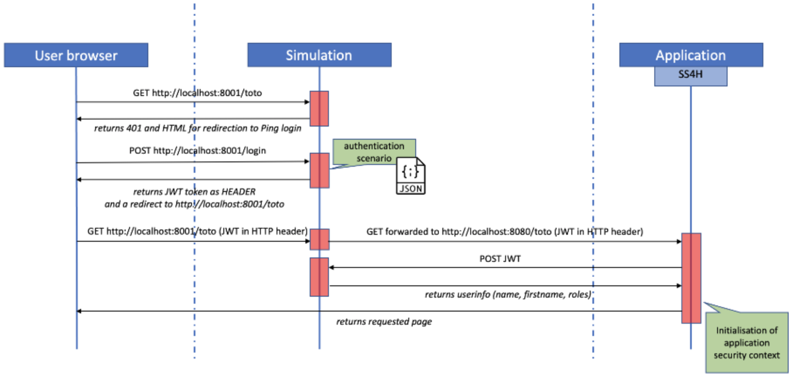
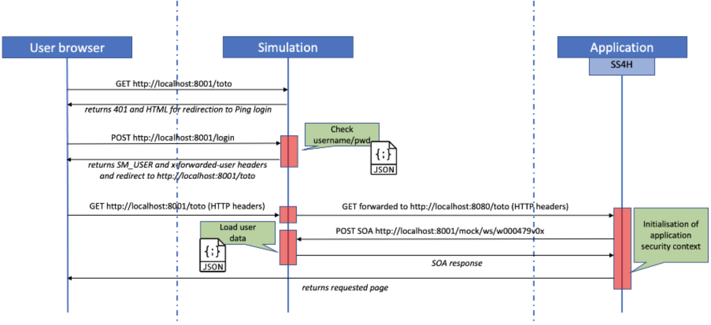
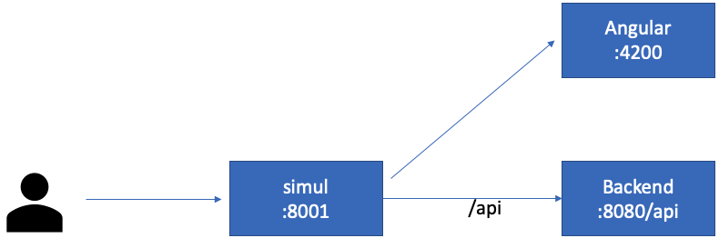

# Spring Security 4 Habile - Simulation/Proxy module

This simulation/proxy module tends to mimic the behavior of the AFKL network infrastucture components (proxy and Ping).

It can be used with both **spring-security-habile (v4.x.x and above)** and also **filterHabile (v3.x and above)** modules. In the rest of this document any time you see SS4H on the backend part, it can be replaced by **filterHabile**.

You can download this module with maven in command line `mvn org.apache.maven.plugins:maven-dependency-plugin:2.8:get -Dartifact=com.afklm.springboot.habile:spring-security-habile-simul:4.x.x -Dtransitive=false -Ddest=simul.jar`. Make sure to target the latest version of
the simulator in order to get latest bug fixes or enhancement.

This simulation module is an independent SpringBoot application. It offers two main configuration modes: full Ping or Ping in SiteMinder compatibility mode.

# Running in full Ping mode

When in Ping mode, we need to provide a configuration file with all the local end-user configured.

This user configuration is done in JSON file where you also define public and anonymous path patterns.

Here is the workflow

The example below shows you a very basic configuration.

	{
		"users": [
			{
				"userId" : "m123456",
				"password" : "password",
				"firstName" : "John",
				"lastName" : "Smith",
				"email" : "John.Smith@company.com",
				"profiles" : [
					"P_ADMIN", "P_USER"
				]
			}
		],
		"anonymousPaths": [
			"/anonymous/**"
		],
		"publicPaths": [
			"/ws/**"
		]
	}

Remark: **publicPaths** and **anonymousPaths** sections are optional.

Remark: **publicPaths** and **anonymousPaths** should include the context root if the backend has any

To launch the proxy is as simple as a JAVA command: `java -jar simul.jar --config.simul=myConfig.json`

As we have no possibility to intercept request that you make to your backend, you need to explicitaly target the simulation module. It listens on **8001** and forwards requests to **8080**.

So if you want to access the http://localhost:8080/api/me after having been authenticated you need to target http://localhost:8001/api/me. You will first be prompted to authenticate and if it succeeds your request will be forwarded to the correct backend endpoint.

If your backend server is not listening on **8080** port, you can configure the simulation accordingly: `java -jar simul.jar --config.simul=myConfig.json --habile.proxy.backend.url=http://localhost:8090`

When running the angular part on your machine you may face CORS issues. In order to avoid them, you then have to configure the proxy to point to our simulation port for all backend invocations: https://confluence.devnet.klm.com/x/ywIuCQ

## Running in Ping SiteMinder compatibility mode

When you run the simulation proxy in SiteMinder compatibility mode, you have two possible configurations. In the first version  your backend application will target the real Habile provider for the **w000479** web service, in that case it is recommended not to define any users in the configuration file of the simulation proxy. In the second one, the proxy is also the provider of the **w000479** web service, so you have to configure a set of users in your proxy configuration file and also to configure your backend application to target the proxy for the **w000479**. 

The way to define public and anonymous path patterns are the same as above (ie. using the configuration file), please refer to the full ping section.

If you need to override the backend port, please refer to the full ping section too.

The activation of the SiteMinder compatibility mode is driver by the property **afklm.security.sm** which must be set to **true**.

### Case 1: users are defined in ua2.airfrance.fr for staging environment

This is the default mode, no configuration file is needed and any user/password is granted access.
Your application is configured to use regular **w000479** running in SOA staging infrastructure. 

If you don't have any public or anonymous endpoints you can simply start the proxy without any configuration file `java -jar simul.jar --afklm.security.sm=true`

If you have public and/or anonymous endpoints, you define them in a configuration file and start the proxy using `java -jar simul.jar --afklm.security.sm=true --config.simul=myConfig.json`

### Case 2: users are defined locally

In that situation the proxy is also the provider of the **w000479** web service. You then need to list the users authorized to access the application in the configuration file. In that case, the simulation proxy application will expose simulation **w000479** endpoints on following urls:

* http://localhost:8001/mock/ws/w000479v01
* http://localhost:8001/mock/ws/w000479v02
You should then configure your application (yml file)with these urls.
You may see current configuration with following url: http://localhost:8001/mock/authorities 

To launch the simulation proxy in that mode is simply done with `java -jar simul.jar --afklm.security.sm=true --config.simul=myConfig.json`

## Running the frontend and backend parts behind the simulation proxy

This feature aims to reproduce as much as possible the real infrastructure by using our simulation proxy to secure all calls to 
front and back, and then be able to route calls either on frontend or backend part.

### Angular frontend

This will give us the following flow

Make sure that your frontend part is listening on an ipv4 interface, the simulation proxy is not able to forward to an ipv6 address so far. 
It can be done with **ng serve --host 0.0.0.0**.

In order to achieve this, we will indicate to the proxy what URL patterns belong to the backend. By adding this configuration
the simulator will then guess there is a frontend part to handle (which is on port 4200) for angular apps. This gives us the command 
`java -jar simul.jar --afklm.security.sm=true --config.simul=myConfig.json --habile.proxy.backend.endpoints=/api/**`

You can check the configuration has been taken into account in the logs. You will see those two lines

	2021-04-29 15:22:36.896  INFO 31270 --- [           main] c.a.s.s.h.proxy.HabileSimulationGateway  : Routing '/api/**' to 'http://localhost:8080'
	2021-04-29 15:22:36.908  INFO 31270 --- [           main] c.a.s.s.h.proxy.HabileSimulationGateway  : Default routing to 'http://localhost:4200'

### Ionic frontend

The default port for **ionic** applications is not 4200 but **8100**. So in order to apply the same configuration as above for ionic application
we need to inject an extra parameter `habile.proxy.angular.url` which takes as parameter the full frontend URL.

We then have the launch command `java -jar simul.jar --afklm.security.sm=true --config.simul=myConfig.json 
--habile.proxy.backend.endpoints=/api/** --habile.proxy.angular.url=http://localhost:8100`

Make sure to check the configuration is correct in the logs

	2021-04-29 15:27:13.580  INFO 31336 --- [           main] c.a.s.s.h.proxy.HabileSimulationGateway  : Routing '/api/**' to 'http://localhost:8080'
	2021-04-29 15:27:13.591  INFO 31336 --- [           main] c.a.s.s.h.proxy.HabileSimulationGateway  : Default routing to 'http://localhost:8100'

## FAQ
### How to change the session timeout for the proxy?
Up to version 3.0.4 (included), the session timeout is set to 600 seconds (10 minutes).

From version 3.0.5, the session timeout is set to 3600 seconds (an hour).

It is possible to change this value (whatever is the version of the proxy you are using) by defining it in the command line: **--afklm.security.habile.simul.session.timeout=<nb_of_seconds>**

### How to change the backend URL targeted by the proxy?

It can be defined in command line with the following parameter **--habile.proxy.backend.url=http://<whatever_url>:<whatever_port>**

### How to change the value of the issuer in the JWT token?

It can be defined in command line with the following parameter **--habile.proxy.hostname=http://host.docker.internal**

### How to open proxy cookies to non HTTP client?

It is possible to modify the value of the **httpOnly** flag of the simulation/proxy cookies. The default value is
**true** because it is an additional security layer against XSS attacks. Anyway you can make the simulation/proxy
cookies available to non HTTP client by launching it with the following parameter **--server.reactive.session.cookie.httpOnly=false**

### How to increase the timeout value?

The default timeout value is of 20 seconds. It means that if the backend or frontend system takes more than **20 seconds** to respond, then the simulation/proxy will display a page indicating **Error contacting...** for a GET or **Method Not Allowed** for POST/PUT/PATCH.... And so, even if the backend/frontend system returns a valid response after 20 seconds.

In some cases, you may want to increase this timeout value. You can do it by launching the simulation/proxy with the following parameter **--resilience4j.timelimiter.configs.default.timeout-duration=30s **
